# SmartSeason - Field Monitoring System

[](https://opensource.org/licenses/MIT)
[](https://www.python.org/downloads/)
[](https://nextjs.org/)
[](https://fastapi.tiangolo.com/)
[](https://www.postgresql.org/)

 **An agricultural field monitoring system that helps track crop progress across multiple fields during a growing season. Built for both smallholder, large acrage farmers and agribusinesses.**

| Dashboard View 1 | Dashboard View 2 |
|------------|------------|
|  |  |


## Table of Contents

- [Overview](#-overview)
- [Features](#-features)
- [Technology Stack](#-technology-stack)
- [Architecture](#-architecture)
- [Prerequisites](#-prerequisites)
- [Installation Guide](#-installation-guide)
  - [Backend Setup](#backend-setup)
  - [Frontend Setup](#frontend-setup)
  - [Database Setup](#database-setup)
- [Environment Configuration](#-environment-configuration)
- [Running the Application](#-running-the-application)
- [API Documentation](#-api-documentation)
- [Demo Credentials](#-demo-credentials)
- [Design Decisions](#-design-decisions)
- [Field Status Logic](#-field-status-logic)
- [Security Features](#-security-features)
- [Screenshots](#-screenshots)
- [Troubleshooting](#-troubleshooting)
- [Roadmap](#-roadmap)
- [Contact](#-contact)
- [License](#-license)

---

## Overview

SmartSeason is a full-stack field monitoring system that enables agricultural organizations to track crop progress, manage field agents, and make data-driven decisions. The system provides role-based access for Administrators and Field Agents, real-time field status calculations, AI-powered insights, and comprehensive dashboards.

- Role-based access control
- AI-powered insights
- Responsive mobile design

---

## Features

### For Administrators

- **Field Management**: Create, update, delete, and assign fields to agents
- **Agent Oversight**: Monitor all field updates across all agents
- **Analytics Dashboard**: View field status distribution, agent workload, crop distribution, and activity trends
- **User Management**: Register new agents and manage user profiles
- **AI Insights**: View AI-generated alerts and stage recommendations

### For Field Agents

- **Assigned Fields**: View and manage only fields assigned to them
- **Field Updates**: Submit stage updates with notes and photos
- **Personal Dashboard**: Track assigned fields, recent activity, and pending updates
- **Profile Management**: Update personal information and profile picture

### General Features

- **JWT Authentication**: Secure token-based authentication with refresh tokens
- **Avatar Upload**: Profile picture upload with image compression
- **Password Management**: Secure password change functionality
- **Responsive Design**: Works seamlessly on desktop, tablet, and mobile devices
- **Real-time Status**: Automatic field status calculation (Active/At Risk/Completed)
- **AI Integration**: Smart stage suggestions and keyword-based alert generation

---

## Technology Stack

### Backend

| Technology | Version | Purpose |
|------------|---------|---------|
| FastAPI | 0.115.6 | High-performance API framework |
| PostgreSQL | 14 | Relational database |
| SQLAlchemy | 2.0.36 | Async ORM with connection pooling |
| Alembic | 1.14.1 | Database migration management |
| Python-JOSE | 3.3.0 | JWT token handling |
| Passlib | 1.7.4 | Password hashing (Argon2) |
| Uvicorn | 0.34.0 | ASGI server |

### Frontend

| Technology | Version | Purpose |
|------------|---------|---------|
| Next.js | 14.2.0 | React framework with App Router |
| TailwindCSS | 4.0 | Utility-first CSS framework |
| Recharts | 2.12.0 | Charting library |
| Axios | 1.6.0 | HTTP client with interceptors |
| Lucide React | Latest | Modern icon library |
| Zustand | 4.5.0 | State management |

---

## Architecture

<div style="display: flex; flex-wrap: wrap; gap: 8px;">
  
</div>

## Prerequisites

Before you begin, ensure you have the following installed:

- **Python 3.10+** - [Download](https://www.python.org/downloads/)
- **Node.js 18+** - [Download](https://nodejs.org/)
- **PostgreSQL 14+** - [Download](https://www.postgresql.org/download/)
- **Git** - [Download](https://git-scm.com/)
- **pip** (Python package manager)
- **npm** or **yarn** (Node package manager)

## Installation Guide

### 1. Clone the Repository

```bash
git clone https://github.com/yourusername/smartseason.git
cd smartseason
```

### 2. Backend Setup

```bash
cd backend
python3 -m venv venv

# Activate virtual environment
# On Linux/Mac
source venv/bin/activate

# On Windows
venv\Scripts\activate

# Install dependencies
pip install --upgrade pip
pip install -r requirements.txt
```

### 3. Database Setup

```bash
sudo -u postgres psql
CREATE DATABASE dbname;
CREATE USER user WITH PASSWORD 'your_secure_password';
GRANT ALL PRIVILEGES ON DATABASE smartseason_db TO user;
\q
alembic upgrade head

# Seed the database with initial data
python seed.py  - Contact me for this file
```

### 4. Environment Configuration (Backend)

Create a `.env` file in the `backend` directory:

### 5. Frontend Setup

```bash
cd ../frontend
npm install
cp .env.local.example .env.local
```

**For setup assistance of environment variables, please contact me, Details Below**

### 6. Running Database Migrations

```bash
cd backend
alembic revision --autogenerate -m "description_of_changes"
alembic upgrade head
```

---

## Environment Configuration

### Backend Environment Variables

| Variable | Description |
|----------|-------------|
| `POSTGRES_HOST` | Database host | 
| `POSTGRES_PORT` | Database port | 
| `POSTGRES_DB` | Database name | 
| `POSTGRES_USER` | Database user | 
| `POSTGRES_PASSWORD` | Database password | 
| `JWT_SECRET` | JWT signing key (min 32 chars) |
| `SERVER_PORT` | API server port | 
| `ENVIRONMENT` | dev/production | 

### Frontend Environment Variables

| Variable | Description |
|----------|-------------|
| `NEXT_PUBLIC_API_URL` | Backend API URL |
| `BACKEND_URL` | Backend base URL |
| `NEXT_PUBLIC_ENABLE_AI` | Enable AI features |

---

## Running the Application

### Start Backend Server

```bash
cd backend
source venv/bin/activate  # On Windows: venv\Scripts\activate
uvicorn main:app --reload --host 0.0.0.0 --port your_port
```

**Expected output:**
```
INFO:     Uvicorn running on http://0.0.0.0:your_port
INFO:     Started reloader process
INFO:     Started server process
INFO:     Database initialized successfully
INFO:     Server ready on http://0.0.0.0:your_port
```

### Start Frontend Development Server

```bash
cd frontend
npm run dev
```

**Expected output:**

```
- Local:        http://localhost:3000
- Environments: .env.local
✓ Ready in 2.3s
```

### Production Build

```bash
# Frontend production build
cd frontend
npm run build
npm start

# Backend production (using gunicorn)
cd backend
gunicorn main:app -w 4 -k uvicorn.workers.UvicornWorker --bind 0.0.0.0:8086
```
---

## API Documentation

Once the backend is running, access interactive API documentation:

- **Swagger UI**: `http://localhost:PORT/docs`
- **ReDoc**: `http://localhost:PORT/redoc`

## Demo Credentials

**For security reasons, full credentials are available upon request. Please contact me directly.**

### Request Access
 
- **Email**: elmuswangudi@gmail.com
 - **Whatsapp**: +254740268061

**Please include in your request:**
- Your name
- Organization/Company
- Purpose of evaluation
- Any specific access needs

I will respond with the appropriate credentials and any additional setup instructions.

---

## Design Decisions

### Why Extended Field Stages?

The assessment included simple stages (Planted, Growing, Ready,  Harvested) which are too basic for real-world Kenyan farming. I implemented an extended lifecycle:

```
Planted, Germination, Vegetative, Flowering, Mature, Harvested
```

This maps to the simple stages via the `to_simple_stage()` method, providing:
- **Better granularity** for agents reporting progress
- **More accurate status calculations** based on crop-specific timelines
- **Future extensibility** for crop-specific stage durations

### Field Status Logic

The status is **computed on-demand** rather than stored, ensuring real-time accuracy:

| Status | Condition |
|--------|-----------|
| **Active** | Field is progressing normally within expected timelines |
| **At Risk** | Planted >14d, or growth stage >30d, or no update >14d |
| **Completed** | Current stage = Harvested |

**Why this approach?**
- Eliminates stale status data
- Easy to adjust thresholds without database changes
- Transparent and explainable to users

### Database Design

```sql
1. Unique constraint on field_assignments.field_id (one field → one agent)
2. Cascade delete for assignments when field is deleted
3. Indexes on frequently queried columns (email, role, field_id, agent_id)
4. Soft delete not implemented for simplicity (hard delete is sufficient)
```

### Authentication Strategy

- **JWT tokens** with refresh rotation (access: 24h, refresh: 7d)
- **Argon2 password hashing** (more secure than bcrypt, resistant to GPU attacks)
- **HTTP-only cookies** not used (localStorage + Axios interceptors for simplicity)
- **Token refresh queue** prevents multiple refresh requests during concurrent failures

### Frontend Architecture

- **App Router** for server components where possible
- **Client components** only where interactivity needed
- **Zustand** for auth state (simpler than Redux)
- **Axios interceptors** for centralized token management
- **Recharts** for accessible, responsive charts

---

## Security Features

| Feature | Implementation |
|---------|----------------|
| **Password Hashing** | Argon2 with memory cost 65536, time cost 3 |
| **JWT Security** | HS256 with 32+ character secrets |
| **CORS** | Restricted origins, credentials allowed |
| **Input Validation** | Pydantic schemas with strict validation |
| **SQL Injection** | SQLAlchemy ORM parameters |
| **XSS Protection** | React's built-in escaping |
| **Rate Limiting** | Implemented on upload endpoints |
| **File Validation** | Type checking, size limits (5MB) |

### Security Best Practices Implemented

1. **Never expose secrets** - All sensitive config in `.env`
2. **Database credentials** - Use dedicated database users with minimal privileges
3. **CORS** - Only allow trusted origins
4. **Error messages** - Generic messages to clients, detailed logging internally
5. **Password policy** - Minimum 8 characters, hashed before storage
6. **Token expiration** - Short-lived access tokens with refresh rotation

---

# Screenshots

### Admin Dashboard

| Dashboard View 1 | Dashboard View 2 |
|------------|------------|
|  | 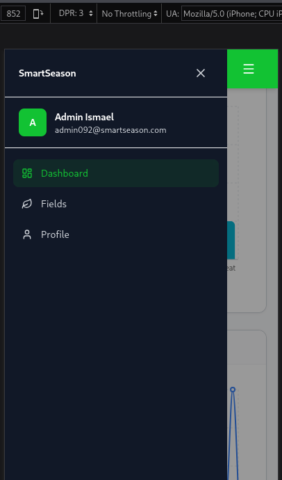 |

### Agent Dashboard
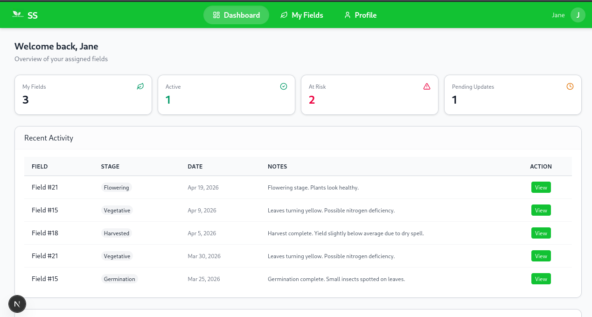
*Personalized view showing assigned fields and recent activity*

### Field Management

*Grid view of all fields with status indicators and assignment controls*


| Fields | Add Fields |
|------------|------------|
| 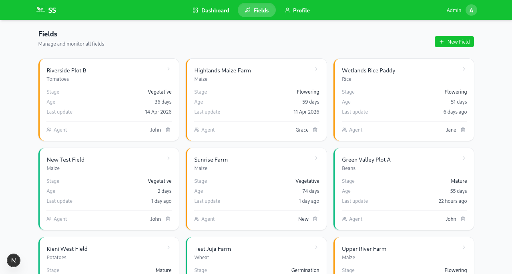 | 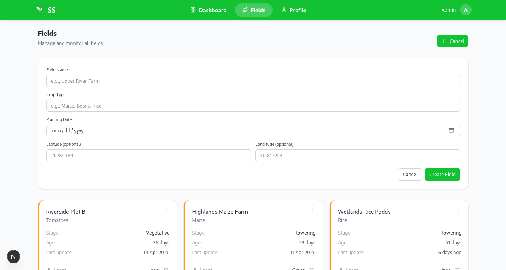 |


### Field Details

*Detailed view with update history and AI recommendations*

| Detailed Field Page | Assign Agent |
|------------|------------|
| 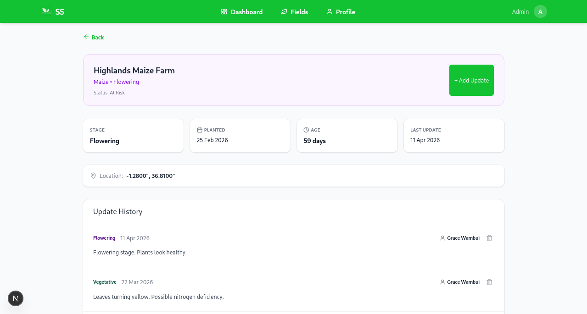 | 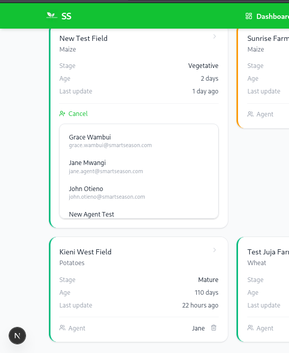 |


### Agent Fields Overview

[](./docs/AgentFields.png)

|  Agent Field Page | Field Details |
|------------|------------|
| 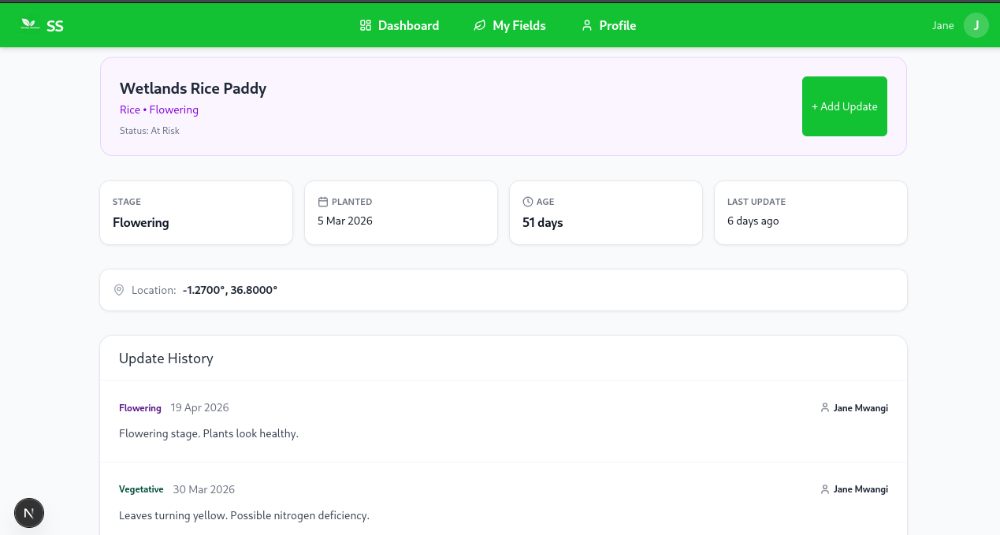 | 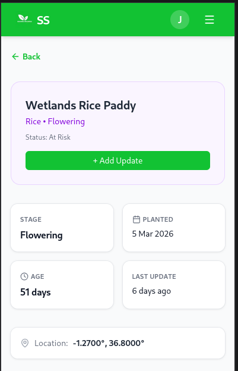 |

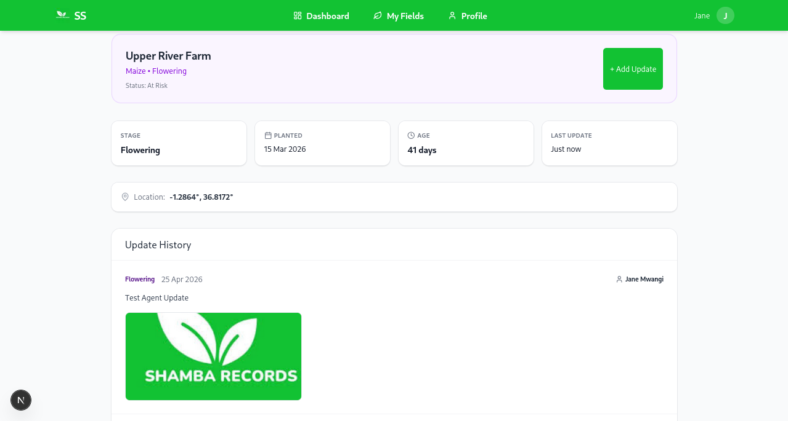


### Profile Management

*User profile with avatar upload and password management*

|  Admin Profile 1 | Admin Profile 2 |
|------------|------------|
| 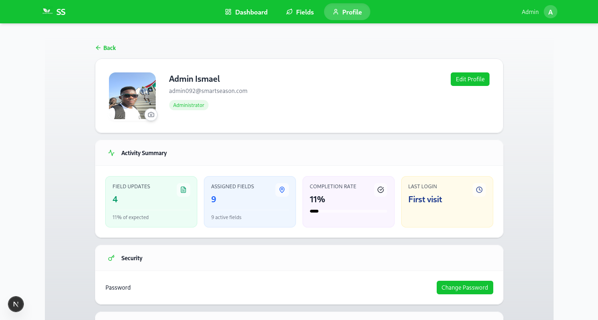 | 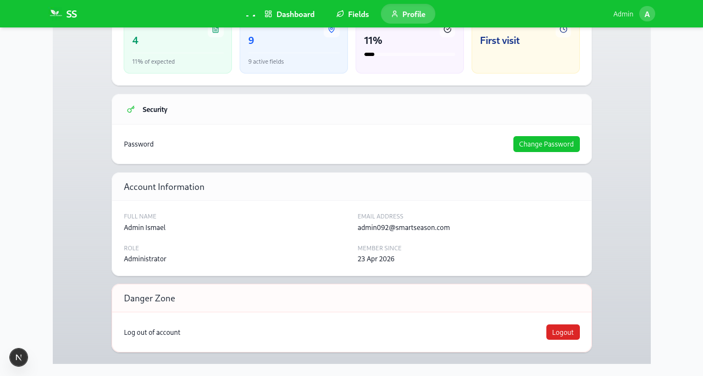 |


### Agent Profile

|  Agent Profile 1 | Agent Profile 2 |
|------------|------------|
| 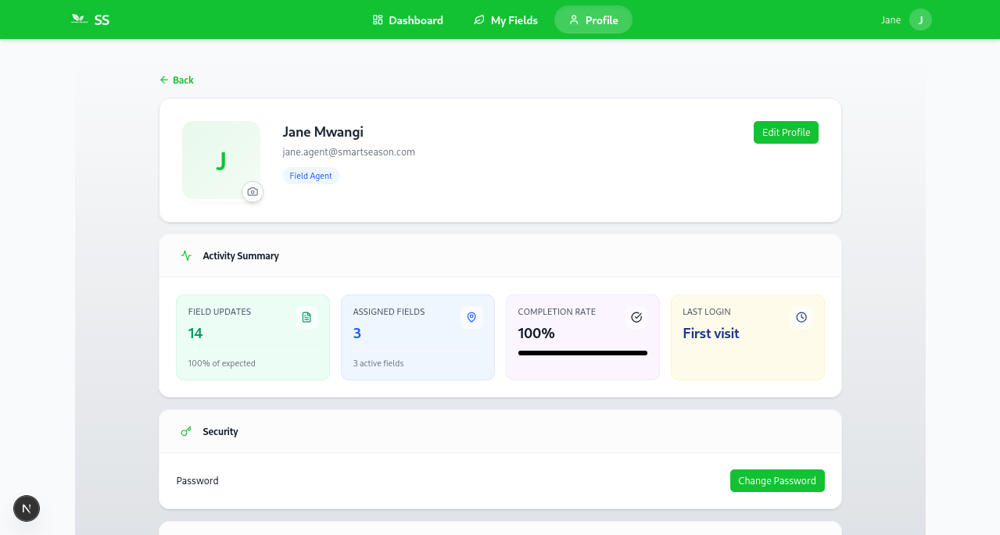 | 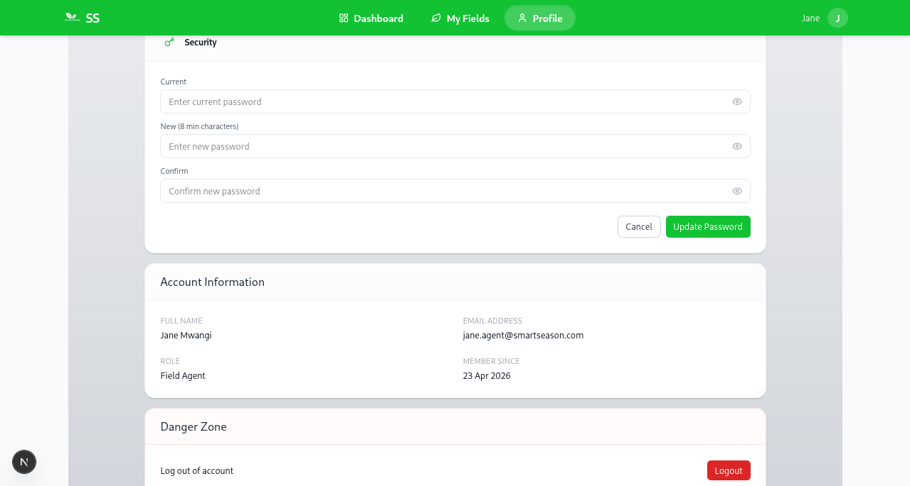 |

---

## Troubleshooting

### Common Issues and Solutions

| Issue | Solution |
|-------|----------|
| **Database connection failed** | Verify PostgreSQL is running: `sudo systemctl status postgresql` |
| **Migrations not applying** | Run `alembic upgrade head --sql` to see SQL without executing |
| **CORS errors** | Check `BACKEND_CORS_ORIGINS` includes your frontend URL |
| **401 Unauthorized** | Token expired - login again or implement refresh |
| **Image upload fails** | Check `uploads/` directory permissions: `chmod 755 uploads` |
| **Module not found** | Activate virtual environment: `source venv/bin/activate` |

---

## Roadmap

### Completed
- Role-based authentication (Admin/Agent)
- Field CRUD operations
- Field assignment management
- Update submission with notes
- AI stage suggestions
- AI alert generation
- Admin dashboard with charts
- Agent dashboard
- Profile management
- Image upload (avatars + field photos)
- Responsive mobile design

### Future Enhancements
- Weather API integration for crop advisories
- SMS notifications for at-risk fields
- Export reports to PDF/Excel
- Multi-language support (English/Swahili)
- Offline mode for low-connectivity areas
- Advanced ML models for yield prediction
- Field boundary mapping with GIS
- Mobile app (React Native)

---

## Contact

**Elmus Ismael Wangudi**
- 📧 Email: [elmuswangudi@gmail.com](mailto:elmuswangudi@gmail.com)
- 🔗 LinkedIn: [linkedin.com/in/elmus-wangudi](https://www.linkedin.com/in/elmus-ismael-153568232/)
- 🌐 Portfolio: [elmuswangudi.site](https://elmuswangudi.site)
- 📱 Phone: +254 740 268 061

**For demo credentials, environment variables, or deployment assistance, please reach out directly.**

---

## Acknowledgments

- **Shamba Records** for the assessment opportunity
- **JKUAT** for foundational engineering education
- **Open Source Community** for the amazing tools and libraries

---

## Project Status

| Metric | Status |
|--------|--------|
| **API Endpoints** | 24 |
| **Database Tables** | 6 |
| **Frontend Components** | 32 |
| **Development Time** | 3 days |
| **Requirements Met** | 100% |

---
