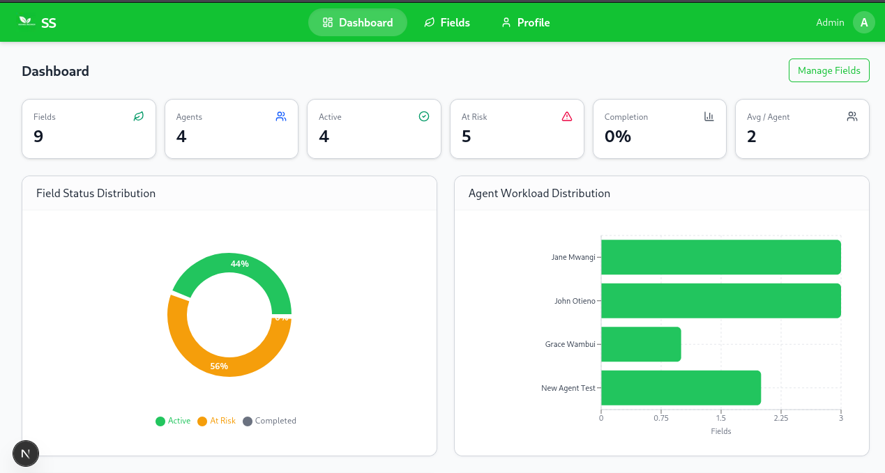
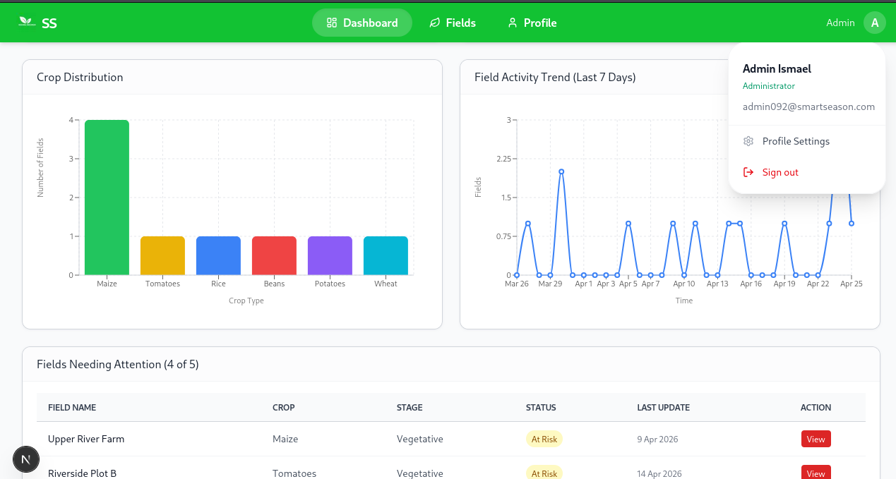
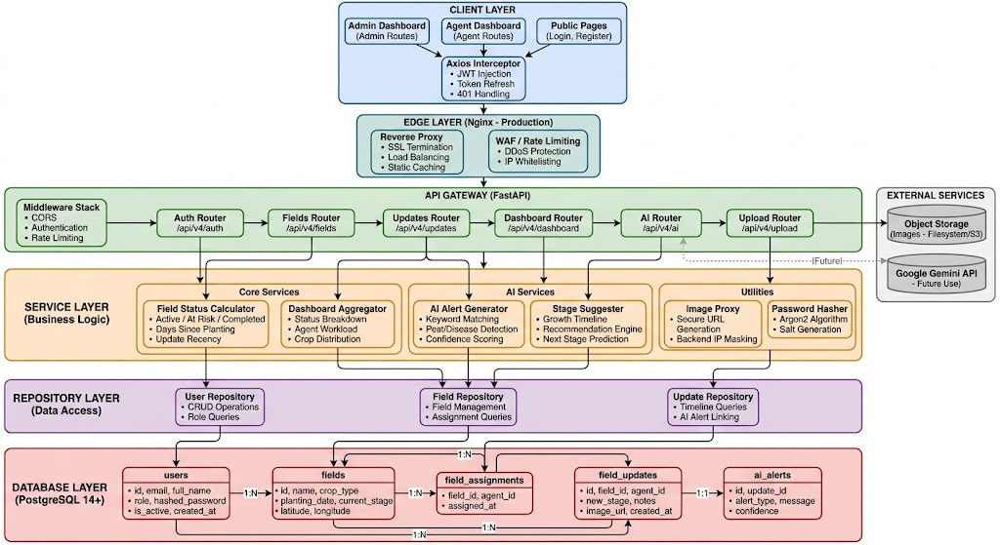

# SmartSeason - Field Monitoring System

> **An agricultural field monitoring system that helps track crop progress across multiple fields during a growing season. Built for both smallholder, large acrage farmers and agribusinesses.**

  
  

## Table of Contents

- [Overview](#-overview)
- [Features](#-features)
- [Technology Stack](#-technology-stack)
- [Architecture](#-architecture)
- [Prerequisites](#-prerequisites)
- [Installation Guide](#-installation-guide)
  - [Backend Setup](#backend-setup)
  - [Frontend Setup](#frontend-setup)
  - [Database Setup](#database-setup)
- [Environment Configuration](#-environment-configuration)
- [Running the Application](#-running-the-application)
- [API Documentation](#-api-documentation)
- [Demo Credentials](#-demo-credentials)
- [Design Decisions](#-design-decisions)
- [Field Status Logic](#-field-status-logic)
- [Security Features](#-security-features)
- [Screenshots](#-screenshots)
- [Troubleshooting](#-troubleshooting)
- [Roadmap](#-roadmap)
- [Contact](#-contact)
- [License](#-license)

---

## Overview

SmartSeason is a full-stack field monitoring system that enables agricultural organizations to track crop progress, manage field agents, and make data-driven decisions. The system provides role-based access for Administrators and Field Agents, real-time field status calculations, AI-powered insights, and comprehensive dashboards.

- Role-based access control
- AI-powered insights
- Responsive mobile design

---

## Features

### For Administrators

- **Field Management**: Create, update, delete, and assign fields to agents
- **Agent Oversight**: Monitor all field updates across all agents
- **Analytics Dashboard**: View field status distribution, agent workload, crop distribution, and activity trends
- **User Management**: Register new agents and manage user profiles
- **AI Insights**: View AI-generated alerts and stage recommendations

### For Field Agents

- **Assigned Fields**: View and manage only fields assigned to them
- **Field Updates**: Submit stage updates with notes and photos
- **Personal Dashboard**: Track assigned fields, recent activity, and pending updates
- **Profile Management**: Update personal information and profile picture

### General Features

- **JWT Authentication**: Secure token-based authentication with refresh tokens
- **Avatar Upload**: Profile picture upload with image compression
- **Password Management**: Secure password change functionality
- **Responsive Design**: Works seamlessly on desktop, tablet, and mobile devices
- **Real-time Status**: Automatic field status calculation (Active/At Risk/Completed)
- **AI Integration**: Smart stage suggestions and keyword-based alert generation

---

## Technology Stack

### Backend

| Technology | Version | Purpose |
|------------|---------|---------|
| FastAPI | 0.115.6 | High-performance API framework |
| PostgreSQL | 14 | Relational database |
| SQLAlchemy | 2.0.36 | Async ORM with connection pooling |
| Alembic | 1.14.1 | Database migration management |
| Python-JOSE | 3.3.0 | JWT token handling |
| Passlib | 1.7.4 | Password hashing (Argon2) |
| Uvicorn | 0.34.0 | ASGI server |

### Frontend

| Technology | Version | Purpose |
|------------|---------|---------|
| Next.js | 14.2.0 | React framework with App Router |
| TailwindCSS | 4.0 | Utility-first CSS framework |
| Recharts | 2.12.0 | Charting library |
| Axios | 1.6.0 | HTTP client with interceptors |
| Lucide React | Latest | Modern icon library |
| Zustand | 4.5.0 | State management |

---

## Architecture

  

